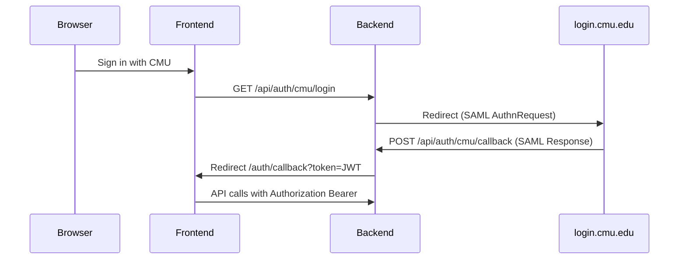

# CMU official login (Shibboleth / SAML)

Production authentication uses **CMU Web Login** (Shibboleth IdP at `https://login.cmu.edu/idp/shibboleth`), not passwords.

## Register as a Service Provider

1. Read [CMU SSO for Service Providers](https://www.cmu.edu/computing/services/security/identity-access/authentication/sso-provider.html).
2. Request SP registration with CMU IT. Provide:
   - **Entity ID** — same as `CMU_SAML_ENTITY_ID`
   - **Assertion Consumer Service (ACS)** — `POST` to `{API_BASE}/api/auth/cmu/callback`
   - **Metadata** — `GET {API_BASE}/api/auth/cmu/metadata` (when SAML is configured)
3. Obtain IdP signing certificate if required (`CMU_SAML_IDP_CERT`).

## Environment variables

Copy from `backend/.env.example` and set in production:

| Variable | Purpose |
|----------|---------|
| `CMU_SAML_ENABLED=true` | Turn on SAML routes |
| `CMU_SAML_ENTITY_ID` | Your SP entity ID (from IT) |
| `CMU_SAML_CALLBACK_URL` | Full ACS URL, e.g. `https://api.yourapp.cmu.edu/api/auth/cmu/callback` |
| `CMU_SAML_PRIVATE_KEY` | SP private key (PEM) |
| `CMU_SAML_PUBLIC_CERT` | SP public cert (PEM) |
| `CMU_SAML_IDP_CERT` | Optional IdP cert for signature validation |
| `FRONTEND_URL` | Where users land after login, e.g. `https://roommate.cmu.edu` |

## Login flow



1. User clicks **Sign in with CMU** → `GET /api/auth/cmu/login`
2. CMU authenticates the user
3. IdP `POST`s SAML assertion to `/api/auth/cmu/callback`
4. Backend creates/updates user (`authProvider: CMU_SAML`), issues JWT
5. Browser redirects to `{FRONTEND_URL}/auth/callback?token=...`
6. Frontend stores token and loads `/api/auth/me`

Only `@cmu.edu` and `@andrew.cmu.edu` emails are accepted.

## Local development

```bash
cd backend && npm run saml:setup   # creates certs/ and fetches CMU IdP cert
# backend/.env: CMU_SAML_ENABLED=true (see .env.example)
```

- `GET /api/auth/config` should return `"cmuSsoEnabled": true`.
- **Real CMU login** still requires [CMU IT SP registration](CMU_IT_REGISTRATION.md) for your entity ID and callback URL.
- Set `AUTH_DEV_PASSWORD=true` to allow seeded password login (`alice@cmu.edu` / `password123`) while waiting on IT.

## Frontend routes

- `/login` — CMU button + optional dev form
- `/auth/callback` — reads `?token=` from SSO redirect
